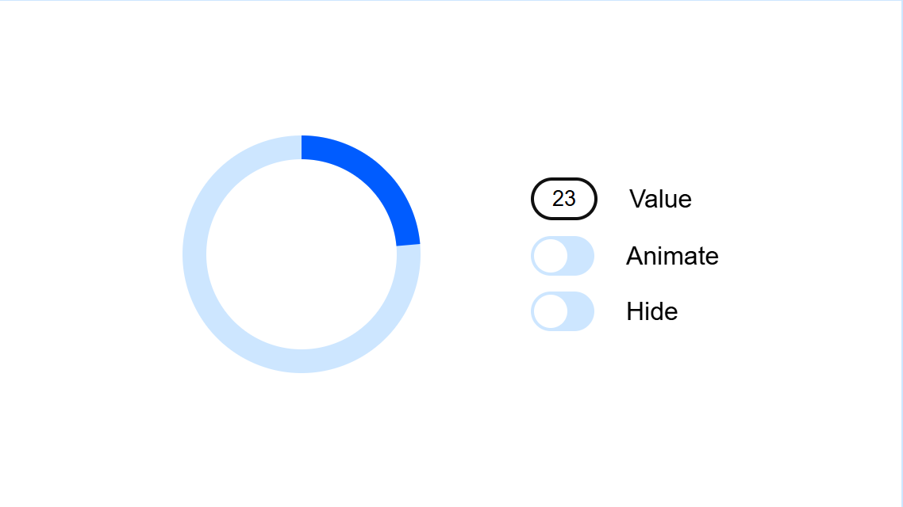

# Круговой лоадер 🔄

  


## 🌟 Возможности
- **Настраиваемая анимация** - Плавное вращение через CSS  
- **Интерактивное управление** - Включение/выключение анимации и видимости  
- **Отображение прогресса** - Визуализация загрузки от 0 до 100%  
- **Доступность** - Поддержка ARIA-атрибутов и клавиатуры  


## 📦 Подключение
```html
<script type="module" src="scriptOfLoader.js"></script>
```


## 🛠 Быстрый старт
```javascript
import { addLoader } from 'ваш-лоадер';

// Добавление лоадера на страницу
// Возвращает уникальный id
const loaderId = addLoader(elem, where); 
// where - это специальное слово, указывающее, куда по отношению к elem
//      производить вставку. Значение должно быть одним из следующих:
 "beforebegin" – вставить html непосредственно перед elem,
 "afterbegin" – вставить html в начало elem,
 "beforeend" – вставить html в конец elem,
 "afterend" – вставить html непосредственно после elem.

```


## 🎛 Управление
```javascript
import { setProgress, removeLoader,
         animateLoader, stopAnimateLoader } from './scriptOfLoader.js';

setProgress(loaderId, 75);      // Установить прогресс (75%)
animateLoader(loaderId);        // Запустить анимацию
stopAnimateLoader(loaderId);    // Остановить анимацию
removeLoader(loaderId);         // Удалить контейнер с лоадером
```
